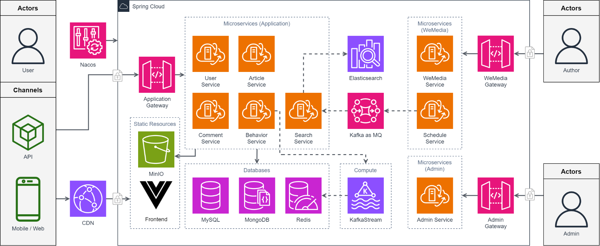

### **ミニプロジェクト**：Javaバックエンド

#### 名称

A we-media Platform Build with Spring Cloud

#### 目的

これは、FlipBoardやnoteに似たコンテンツプラットフォームです。プロジェクトは3つの部分で構成されており、それぞれユーザーモバイルアプリケーション、著者ダッシュボード、および管理ダッシュボードです。

#### 総覧:

プロジェクトはSpring Cloudを採用しており、3つの主要な機能ブロックを8つのマイクロサービスに分解しています。

1. **UserService**: ユーザーのログイン行動を担当するマイクロサービス
2. **ArticleService**: 記事リストの読み込み、記事の公開・非公開などを担当するマイクロサービス
3. **CommentService**: ユーザーのコメントを担当するマイクロサービス
4. **BehaviorService**: ユーザーの行動（閲覧、いいね、嫌い）を担当するマイクロサービス
5. **SearchService**: 全文検索を担当するマイクロサービス
6. **WemediaService**: 著者が画像素材をアップロードし、記事をアップロードおよび管理するマイクロサービス
7. **ScheduleService**: 汎用のスケジュールタスクマイクロサービス
8. **AdminService**: プラットフォーム管理を担当するマイクロサービス

#### **技術的なチャレンジと解決策**

##### 記事の定時公開

**問題**：

記事を指定された時刻に自動的に公開するには、複数の技術的な課題が存在します。まず、記事の公開タイミングを正確に管理し、スケジュール通りに公開する方法が必要です。また、大量の記事データを効率的に処理し、システムのパフォーマンスに影響を与えないようにすることも重要です。さらに、データの整合性を保ち、複数のスレッドが同時に操作することで生じる競合状態を回避する必要があります。

**解決策**

コアのアイデアは、タスクを提出するとき、まず情報をMySQLに書き込むことです。次に、設定されたWarm-Up Timeに基づいて、未来5分間のタスクをzsetに入れて事前にウォームアップします。その後、毎分zsetの中で現在の時間より大きいタスクをチェックし、消費用のリストに入れます。

特に注意すべき点は、複数のスレッドが同時に操作することでデータの重複が発生するのを避けるために、2つの分散ロックを設定する必要があることです。

**Q**: なぜRocketMQ、RabbitMQなどの遅延メッセージをサポートするメッセージキューを使わないか？

**A**: RocketMQの場合は、性能の考慮から、メッセージキューは固定期間の遅延メッセージのみをサポートし、ニーズを満たすことができない。RabbitMQはカスタム期間の遅延メッセージをサポートし、同時に高可用性、持続性などの特性を持っており、ニーズを満たすことができる。しかし、ニーズのリアルタイム性が高くないため、ここではRedisを利用してConsumer Pullモデルの遅延メッセージキューを実装してみました。

##### 記事の公開とインデックス構築

**問題**：

記事を公開する際、記事を検索できるようにするために、HTMLファイルの構築とElasticsearchのインデックス情報の更新が必要です。しかし、HTMLファイルの構築とインデックスの更新はどちらもディスクIOを消費する操作です。大量の記事が同時に公開される状況では、これらの操作がシステムに与える負荷が大きくなります。特に、同時に大量の公開リクエストが送られる場合、単純な非同期呼び出しではリソースの競合やパフォーマンスの低下が懸念されるため、より効率的でスケーラブルなアプローチが必要です。

**解決策**

HTMLファイルの構築とインデックスの更新は同期して実行できる操作です。そのため、これらを2つのマイクロサービスに分けて実行することができます。ArticleServiceはHTMLファイルの構築を担当し、それをMinIOにアップロードし、MySQLにURLを記録します。SearchServiceはElasticsearchのインデックス更新を担当します。

しかし、ミクロサービス間の通信手段を決定する必要があります。この場合、Kafkaが採用されています。Kafkaが選ばれた理由は、その優れた性能だけでなく、Consumer Groupをサポートしているためです。同じトピックをサブスクライブする2つのコンシューマーグループを設定することで、通信プロセスを実現できます。

##### ユーザー行動記録

**問題**：

ユーザーは短時間で特定の記事に対して大量の閲覧や「いいね」リクエストを生成する可能性があります。情報を直接MySQLに書き込むのは明らかに現実的ではないため、より効率的なストレージ方法が必要です。

**解決策**

RedisのHashを使って、記事ごとのユーザーの行動を保存します。HashのKeyは、行動の種類と記事のIDで、FieldはユーザーID、Valueはユーザーの行動の情報です。

| Key                          | Field  | Value                 |
| ---------------------------- | ------ | --------------------- |
| READ-BEHAVIOR-{ArticleID}    | UserID | ReadBehaviorObject    |
| LIKE-BEHAVIOR-{ArticleID}    | UserID | LikeBehaviorObject    |
| DISLIKE-BEHAVIOR-{ArticleID} | UserID | DislikeBehaviorObject |

閲覧行動オブジェクトの例

Valueの部分は、Protobufを使ってエンコードします。これにより、メモリ使用量を節約できます。

##### リアルタイムで人気記事を推薦

**問題**

リアルタイムの記事推薦は、変化するユーザー関心とトレンドに適応することが難点です。データ処理能力と応答速度が重要になります。

**解決策**

Kafka Streamsを使用してストリーム処理を行い、取得したユーザー行動メッセージを記事IDでグループ化します。10秒間のウィンドウで、さまざまな行動を一つのメッセージにまとめます。

消費者は一定のアルゴリズムに従って記事のスコアを計算し、MySQLに更新します。ZSETに保存されている人気記事リストを置き換えます。

